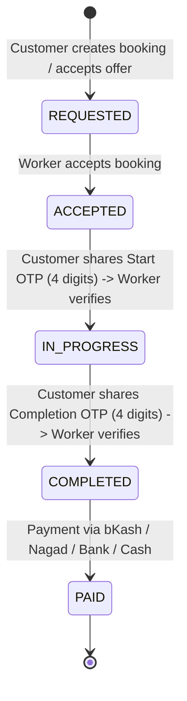
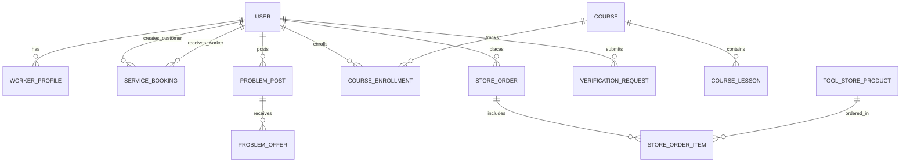

# SkillVerse System Architecture

SkillVerse is an AI-powered verified skills marketplace and on-demand home service ecosystem tailored for Bangladesh. The platform bridges skilled technicians with home and commercial customers with strict NID authentication, AI price auditing, dual-stage OTP job verification, training academy, and direct tool marketplace.

---

## 1. High-Level Architecture Overview

```mermaid
graph TD
    Client["Frontend SPA (React 18 + Vite)"]
    AdminPortal["Admin Command Center (/admin)"]
    
    subgraph Frontend Layer
        Client --> Components["UI Components & Map Engine (Leaflet)"]
        Components --> LocalCache["Per-User Isolated LocalStorage"]
    end

    subgraph Backend Layer (Spring Boot @ port 8081)
        REST["REST API Controllers (11 Controllers)"]
        Services["Business Logic & AI Auditing Engine"]
        Repos["Spring Data JPA Repositories"]
    end

    subgraph Persistence Layer
        DB[("Relational Database / H2 Engine")]
    end

    Client -->|HTTP / JSON REST API| REST
    AdminPortal -->|Password Protected Auth (000000)| REST
    REST --> Services
    Services --> Repos
    Repos --> DB
```

---

## 2. Core Subsystems

### A. Authentication & Role-Based Access Control (RBAC)
- **Public Portal**: Unauthenticated visitors arrive on a modern Landing Page overview (`/`).
- **Standard Authentication**: Allows registration and login strictly for `CUSTOMER` and `WORKER` roles.
- **Admin Isolation**: Admin access is strictly routed to `/admin`, requiring the Master Admin Security Key (`000000`). Admin options are completely excluded from public authentication screens.

### B. Geo-Spatial Service Discovery & Bidding Engine
- **Customer Side**:
  - Interactive OpenStreetMap integration with default standard tile layer and night mode toggle.
  - GPS-based radius filtering (500m, 1km, 3km, 5km, 10km, All Areas).
  - Direct Booking with AI Price Estimation & Safety Auditing.
  - Custom Problem Post broadcasting with image attachments, max budget, and location.
- **Worker Side**:
  - Live problem feed with direct bidding and counter-offering.
  - Real-time GPS distance calculation relative to worker's base area.

### C. 4-Stage Secure Job Lifecycle (Dual-OTP Validation)


1. **Requested / Counter-Offered**: Booking created with initial pricing or custom negotiation.
2. **Accepted**: Worker confirms assignment; Start OTP generated.
3. **In-Progress**: Worker arrives at customer location; Customer validates Start OTP to begin clock.
4. **Completed**: Work done; Completion OTP entered to prevent premature completion.
5. **Settled**: Payment processed; Platform commission deducted dynamically; Worker wallet credited.

### D. SkillVerse Academy
- Comprehensive vocational courses (e.g., Inverter AC Maintenance, Smart Home IoT, Advanced Electrical Diagnostics).
- Chapter lessons with video stream preview, duration tracking, and progress percentage.
- Worker career level upgrade (Silver → Gold → Platinum) upon passing academy modules.

### E. Professional Tools & Equipment Store
- Curated marketplace for industrial-grade tools, replacement components, and PPE safety gear.
- Category filtering, dynamic shopping cart, stock management, and delivery checkout.

### F. Administrative Command Center
- **Worker Verification Queue**: Review National NID photos, trade certificates, experience, and approve/reject applications with live badge counts.
- **Platform Financials**: Configure platform commission rate (e.g., 10%) dynamically, review gross revenue, platform cut, and worker payouts.
- **Content Management**: Create and manage academy courses and tool store products.

---

## 3. Technology Stack

| Layer | Technologies Used |
|---|---|
| **Frontend** | React 18, Vite, Lucide React, Leaflet & React-Leaflet, Vanilla CSS Design System |
| **Backend** | Java 17, Spring Boot 3.x, Spring Data JPA, Hibernate, Jackson JSON |
| **Database** | H2 Database (File & In-Memory runtime), Relational schema |
| **Mapping** | OpenStreetMap, CartoDB Dark Matter tiles, Haversine geo-distance formulas |
| **Security** | Role-based gatekeeping, isolated `/admin` master password, dual OTP generator |

---

## 4. Entity Relationship Diagram (ERD)


